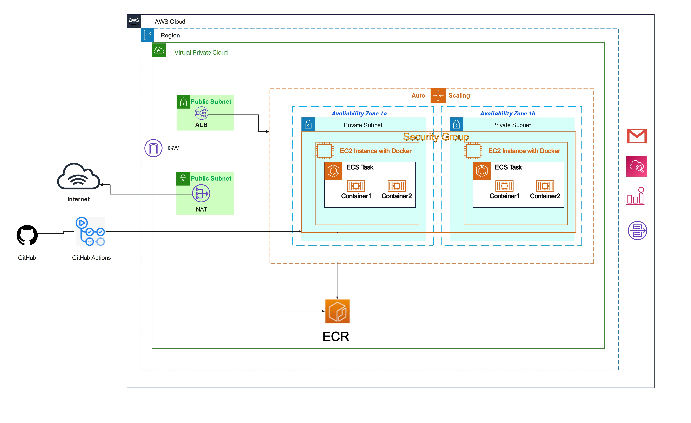

## PHP Project Deployment on Amazon ECS with CI/CD ##

## Project Overview: ##
The "PHP Project Deployment on Amazon ECS with CI/CD" project involved designing and implementing a robust CI/CD pipeline to deploy a PHP web application on Amazon Elastic Container Service (ECS). By leveraging GitHub Actions and Docker containers, the project achieved automated and consistent deployments across different environments. The use of Amazon ECR and ECS enabled secure image management, auto-scaling, and high availability.

## Technologies Used: ##

AWS (Amazon Web Services) for cloud infrastructure 
Amazon ECS (Elastic Container Service) for container orchestration 
Amazon S3 for env file 
Amazon ALB for load balancing 
Amazon VPC for networking 
Docker for containerization of the PHP application 
Amazon ECR (Elastic Container Registry) for Docker image management 
Amazon Auto Scaling Groups with EC2 for hosting containers 
Amazon SNS for notification when auto scaling occurs 
GitHub Actions for CI/CD automation 
Amazon IAM for creating roles 
Amazon Lambda for restoring database 
Amazon RDS (Relational Database Service) for the application's database 
Amazon CloudWatch for centralized logging and monitoring 

## Key Features: ##

Containerization with Docker: The PHP application was containerized using Docker, providing consistency across development, testing, and production environments. This approach facilitated easy packaging and ensured that the application worked consistently across different platforms.

CI/CD Pipeline with GitHub Actions: GitHub Actions workflows were implemented for automated testing, building Docker images, and deploying the PHP application to Amazon ECS on every code push. This streamlined the development process and reduced manual intervention during deployments.

ECS Cluster with Auto-Scaling and Load Balancing: An ECS cluster was configured with auto-scaling and load balancing capabilities to handle varying traffic demands. This ensured high availability, seamless scaling, and efficient resource utilization.

Secure Image Management with Amazon ECR: Docker images were stored securely in Amazon ECR, allowing version control and reliable image retrieval for deployments.

Database Management with Amazon RDS: Amazon RDS was utilized to host the application's database, ensuring data persistence and high performance. The use of RDS simplified database management tasks and provided automated backups.

Centralized Logging and Monitoring with Amazon CloudWatch: Amazon CloudWatch was set up to monitor the PHP application's performance and log events centrally. This enabled proactive troubleshooting and performance optimization.

Security: AWS security groups were configured to control inbound and outbound traffic, while IAM roles ensured secure access to AWS resources.

## Design and Architecture: ##
The project architecture involved:

Dockerized PHP Application: The PHP application was containerized using Docker and stored in Amazon ECR. 
Amazon ECS Cluster: An ECS cluster managed the deployment of containers across multiple instances. 
Amazon Auto Scaling Group as capacity provider for ECS Cluster 
GitHub Actions CI/CD Pipeline: GitHub Actions workflows triggered automated testing, Docker image building, and ECS deployment. 
Amazon RDS: The application's database was hosted on Amazon RDS. 
Amazon CloudWatch: Monitoring and logging were centralized using Amazon CloudWatch. 

## Challenges and Learnings: ##
The major challenge was designing the CI/CD workflow to ensure smooth integration with Amazon ECS and managing environment variables securely. This project provided valuable experience in building efficient CI/CD pipelines and containerized deployments.

## Conclusion: ##
The "PHP Project Deployment on Amazon ECS with CI/CD" project successfully demonstrated the implementation of a robust and automated deployment pipeline for a PHP web application. Leveraging AWS services, Docker containers, and GitHub Actions, the project achieved rapid, consistent, and scalable deployments. Through this project, I acquired hands-on experience in modern CI/CD practices, Docker containerization, and AWS cloud infrastructure.